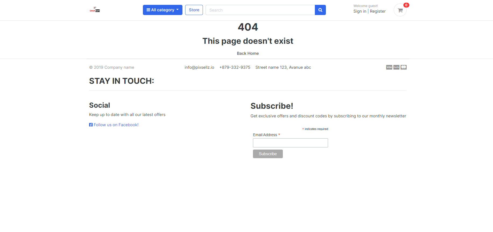

# Greatkart
Welcome to Greatkart where you can find inspired clothes products available to buy. This (B2C)e-commerce store was built using Django and Python, deployed on Heroku.

This website provides full CRUD functionality to the admin user to add and delete products from the purposely built admin panel. Customers are able to view a history of all orders placed from their profile login. The goal of this assignment is to create a web interface that allows users to simply store and access and performance the CRUD (Create, Read, Update, and Delete) actions. This project's goal is to allow users to create, store, modify, and remove posts (CRUD). People that are interested in topics such as travel or planning to live abroad are the target audience for this initiative. Users can create new orders.

The following details should be used when trying to submit an order on the checkout page:
- Card number 4242 4242 4242 4242
- Expiration Date: Any future date (e.g. 09/24)
- CVC: Any three digits

View the live site [here](https://kart2022.herokuapp.com/)

<br>

# Overview

- [User experience](#user-experience)
  * [User Stories](#user-stories)
- [Wireframes](#wireframes)
- [Database schema](#Database-schema)
- [Features](#features)
  * [Current Features](#current-features)
  * [Signed In Users](#signed-in-users)
  * [Future Prospects](#future-prospects)
- [Database](#database)
- [Testing](#testing)
- [Search engine optimization](#search-engine-optimalization)
- [Web marketing](#web-marketing)
- [Technologies Used](#technologies-used)
  * [Languages](#languages-used)
  * [Libraries & Integrations](#frameworks-libraries-and-programs)
- [Deployment](#deployment)
  * [Set up project locally](#set-up-project-locally)
  * [Deploy to Heroku](#deploy-to-heroku)
  * [AWS Static files storage](#aws-static-files-storage)
- [Credits](#credits)
  * [Code](#code)
  * [Content](#content)
  * [Media](#media)
  * [Acknowledgements](#acknowledgements)

# User experience

## Site Purpose
- The intent of this site is to do online shopping.
## Site Goal
-  To build a platform that allows users to easily share their comments and do shopping.
## Communication
- With a clean, easy to follow layout, the users are guided through the features of the website with an ease of navigation.
## Project Goals
- Create a fully functional e-commerce website to allow users to purchase fashion products - including, but not limited to, features such as easy uch as easy payment gateway, authentication system, search and filter functionality, high quality product images, clear product descriptions, ratings, shopping bag and a single payment system.

## User Stories

### As a Customer:

- Website experience:

    1. I want to see how online shopping are made on the website.
    2. I want to be able to navigate the website.
    3. I want to be able to contact the seller.
    
    <br>

- Account:

    1. I want to save my details to a user profile.
    2. I want to be able to see my previous orders details.

###  Navigation
- As a User I can immediately understand the website's purpose so that I know if it's what I'm looking for.
- As a User I can navigate around the site so that I can easily view desired content.
- As a User I can view a list of products so that I can choose one to purchase.
- As a User I can click on a product so that I can read the product details.
- As a User I can search products so that I can find specific products I'm looking for.

### User's review
- As a User I can write a review and post it so that other users can view them.
- As a User I can view my reviews so that I can see and manage all reviews I have created.

### User Interaction
- As a User I can write a review on products so that I can give my feedback to others.
- As a User I can view the number of reviews on a products so that I can see which is most popular.

### Sign in
- As a User I can register for an account so that I can begin to use the services.
- As a User I can log in/out so that I can like products, comment on products and manage my products.
- As a User I can see my login status so that I know if I'm logged in or out.

### As the owner of the Website:

  1. I want to be able to add products with ease.
  2. I want to be able to edit and delete the orders.
  3. I want to have access to an admin page. 
  4. I want to be able to delete inappropriate orders as well.

In order to demonstrate an Agile approach to this project, GitHub issues were used as a Kanban board to record the user stories. The user stories were categorised into different User functions between the Admin and the User and each issue would be moved from the "to-do" board to the "done" board as the project progressed.

The Project Kanban board.
[Kanban board](https://github.com/surba778/greatkart/blob/main/readme-images/Kanban%20board.png)

## User stories - Admin features

The following user stories were satisfied, which include these features:

[User Story #11](https://github.com/surba778/greatkart/issues/11) As a administrator I can click on the navbar and select "login" so that I can make a booking on behalf of a customer.

[User Story #12](https://github.com/surba778/greatkart/issues/12) As a administrator I can view pending customer bookings so that I can approve or reject reservation requests.

## User stories - User features

The following user stories were satisfied by downloading the Django Allauth application which provides the project with built in tools to manage authentication, registration and account management:

[User story #13](https://github.com/surba778/greatkart/issues/13) As a User I can click on navbar and select "register" so that I can create a personal account.

[User story #14](https://github.com/surba778/greatkart/issues/14) As a User I can login by inserting my email and password so that I can create a booking.

## All User stories list

- As a Site User I can register for an account so that I have my personal account information.
- As a Site user I can login/logout of my account so that I have access to my account profile details and previous orders.
- As a Site User I can recover my password in case I forget it so that I can regain access to my account.
- As a Site User I can receive an email confirmation after registration so that I can confirm my account creation.
- As a Site User I can personalise the user profile so that I can view my order history/confirmations/save my payment information.
- As a Shopper I can browse a list of products so that I can pick some I'd like to buy.
- As a Shopper I can view a certain product's details so that I see a full description, ratings, picture, sizes.
- As a Shopper I can see my cart total anytime so that I can be within budget.
- As a Shopper I can view a category of a product so that I can easily find a product I'm interested in without having to browse too much.
- As a Shopper I can sort the products' list so that I can sort products by specific filters.
- As a Shopper I can sort more than one category so that I can better tailor the filters to my needs.
- As a Shopper I can search/query a product so that I can find a specific product easily.
- As a Shopper I can see the result of my query so that I can find out if the shop stocks the product I'm looking for.
- As a Shopper I can pick size/quantity of product when buying it so that I don't accidentally select the wrong size/quantity.
- As a Shopper I can see the items in my cart so that I can have control over my spending.
- As a Shopper I can update the amount of items in my cart so that I can make adjustments before checking out.
- As a Shopper I can input my card details with ease so that I can quickly checkout.
- As a Shopper I can safely input my details so that my details are secure.
- As a Shopper I can view my order and confirmation of the order after checking out so that I can double-check the order is correct.
- As a Shopper I can get an email confirmation of my order which I can keep for my records.
- As a Site Admin I can add a product so that I can keep the inventory updated with new merch.
- As a Site Admin I can update a product so that I can change the price/image/description/name.
- As a Site Admin I can delete a product so that I can delete items which I no longer wish to sell.
- As a Site User I can see a custom 404 page so that I'm not confused as to why I didn't land on the page I had intended to.
- As a Shopper/Potential Shopper I can find a contact page so that I can easily contact the shop with any questions/concerns.
- As a Shopper I can subscribe to a newsletter so that I can keep up to date with new collections, sales, discounts.
- As a Shop Owner I can link a privacy policy so that shoppers know how their data is collected and processed.
- As a Site Owner I can improve my SEO so that I improve my search engine ranking.
- As a Shop Owner I can create a FB business page so that I can gain more traction from socials.
- As a Shopper I can see a FAQ page so that I can find the most frequently asked questions, without having to contact the shop.
- As a Shopper I can see an about page from the shop so that I can learn more about its story, and gain trust from the brand.
- As a Shopper I can add a product to a wish list so that I can purchase it at a later stage.
- As a Shopper I can leave a review of a product so that other users can see my opinion.

# Wireframes


# Database schema
[Database schema](https://github.com/surba778/greatkart/blob/main/readme-images/db-schema.png)
[Flow cycle](https://github.com/surba778/greatkart/blob/main/readme-images/CYCLE.png)

# Features
       
## Signed In Users and also for admin

- This is a summary of the features available only to login users:

    - Signed In users:
        - Sign out
        - Add and remove (only you own) the orders
        - Access orders history 
        - Add, edit and delete orders
        - Access Django admin page: (which involves access to every database and allows to answer costumer messages)
        [User signed in](https://github.com/surba778/greatkart/blob/main/readme-images/user%20signedin.jpg)
        [User invoice page](https://github.com/surba778/greatkart/blob/main/readme-images/user%20invoice%20page.jpg)
        [User Checkout page](https://github.com/surba778/greatkart/blob/main/readme-images/user%20checkout%20page.jpg)
        [Purchase confirmation](https://github.com/surba778/greatkart/blob/main/readme-images/purchase%20confirmation.jpg)
        [Successful signin page](https://github.com/surba778/greatkart/blob/main/readme-images/successful%20signin.jpg)
        [Admin page](https://github.com/surba778/greatkart/blob/main/readme-images/admin%20page.jpg)
        [Admin product page](https://github.com/surba778/greatkart/blob/main/readme-images/admin%20product%20page.png)

### The Admin View
Employing all CRUD features - The administrator can Create, Read, Update and Delete any of these tables.


## Future Prospects 
 
- Log in and registration via social media account. 
- Functionality to 'save' products to a wishlist. 
- Allow users to delete their account. 
- Custom branded 500 error page would be nice to add in the future.

<br>

# Database

- The SQLite relational DBMS has been used in development to store the data for the project. 
- PostgreSQL relational DBMS has been used in production. 

## Models

- Users
  - User
    - From Django Allauth containing the username, email, and password.
  - UserProfile
    - Model containing the user's details for future reservation.

## Validator Testing
  - [Python validator](http://pep8online.com/)()
  - [HTML Validator](https://validator.w3.org/#validate_by_input)()
  - [CSS Validator]()
  - [Lighthouse responsive test](https://github.com/surba778/greatkart/blob/main/readme-images/Responsive%20test.jpg)
  - [Mobile test](https://github.com/surba778/greatkart/blob/main/readme-images/mobile%20test.jpg)
  - [Desktop test](https://github.com/surba778/greatkart/blob/main/readme-images/Desktop%20test.jpg)


## Assumptions and Dependencies
Testing is dependent on the website being deployed live on Heroku.

## Access Requirements
Tester must have access to the Django Admin panel in order to manually verify the insertion of records into the databases.

## Regression Testing
Features previously tested during development in a local environment must be regression tested in production on the live website.

## Manual Testing
All user stories have been included in testing along with each model, each test was ticked off the above list when receiving the expected results.

When manually testing paypal payments it was also important to check if the order still completes or not.

When adding, updating or removing events from the cart the quantity and totals updates correctly. After placing an order the quantity of the sold event also updates reducing the quantity available.

A custom 404 page was created for when the user navigates to a link that doesn't exist.


- All Models work correctly.
- All Forms work correctly.
- All Links lead to the correct destinations.
- Quantitys change correctly.
- Items can be removed from the cart correctly.
- Cart quantity updates correctly.
- Default billing in profile can be updated correctly.
- Emails working correctly.
- User profiles can be created.
- Passwords can be reset by email.
- Admin can view admin only pages, and Users cannot access these pages without superuser status.
- Events can be added both front and backend correctly.
- Site responsiveness was tested from mobile, tablet and laptop.
- Site was tested in iOS, Chrome, Safari, and google chrome browser extension for multi browser testing.
- All HTML, CSS, Javascript & Python checked and passed validators.

All expected results have passed during manual testing.

# Search Engine Optimalization

SEO techniques were implemented to the best of my ability. The site has been equipped with sitemap generated [here](https://www.xml-sitemaps.com/) and robots.txt. 

The site also has privacy policy and terms of service - both documents generated [here](https://policymaker.io/)

## Web Marketing

### Newsletter

The Page owner can send regular interesting content containing advice on greatkart to the subscribers. 

I wanted to give the visitor a freedom to sign up to the newsletter.

### Facebook

This greatkart utilises [facebook](https://www.facebook.com/GreatKart-112825531400432/?notif_id=1658169648191913&notif_t=page_user_activity&ref=notif) for marketing purposes to post adverts, interesting content and get users engaged.


# Technologies Used

## Languages 

- [HTML](https://en.wikipedia.org/wiki/HTML5)
- [CSS](https://en.wikipedia.org/wiki/Cascading_Style_Sheets) 
- [JavaScript](https://en.wikipedia.org/wiki/JavaScript)
- [Python](https://www.python.org/)

## Libraries & Integrations
- [Django](https://www.djangoproject.com/)
    - Used as the primary framework to build the project.
- [Django Crispy Forms](https://django-crispy-forms.readthedocs.io/en/latest/)
    - Used to render the forms on the site.
- [Django Allauth](https://django-allauth.readthedocs.io/en/latest/index.html)
    - Used for user authentication on the site.
- [Django Countries](https://pypi.org/project/django-countries/)
    - Used to populate the countries select field on the order form and profile form.
- [Coverage](https://pypi.org/project/coverage/)
    - Used to produce a testing report.
- [Paypal](https://paypal.com/gb)
    - Used to handle payments.
- [Bootstrap](https://getbootstrap.com/)
    - Used as a framework for styling and to make the site responsive via grid system.
- [SQLite](https://www.sqlite.org/index.html)
    - Database used in development.
- [PostgreSQL](https://www.postgresql.org/)
    - Database used in production.
- [Heroku](https://id.heroku.com/login)
    - Online Cloud Platform used to deploy the live site.
- [Gunicorn](https://gunicorn.org/)
    - Used for deploying the project to Heroku.
- [Fontawesome](https://fontawesome.com/)
    - Used for icons across the website. 
- [Google Fonts](https://fonts.google.com/)
    - Used to import "Roboto" & "Mrs Saint Delafield" fonts used across the website. 
- [jQuery](https://jquery.com/)
    - Used to simplify JavaScript code. 
- [Github](https://github.com/)
    - Used to store the project code after being pushed from Git.
- [Git](https://git-scm.com/) 
    - Used for version control to commit to Git and Push to GitHub.
- Balsamique was used to create the wireframes as part of the project scoping phase of this project

<br>

# Deployment

This project was deployed using Github and Heroku.

- ## Github 

    To create a new repository I took the following steps:

    1. Logged into Github.
    2. Clicked over to the ‘repositories’ section.
    3. Clicked the green ‘new’ button. This takes you to the create new repository page.
    4. Once there under ‘repository template’ I chose the code institute template from the dropdown menu.
    5. I input a repository name then clicked the green ‘create repository button’ at the bottom of the page.
    6. Once created I opened the new repository and clicked the green ‘Gitpod’ button to create a workspace in Gitpod for editing.
    
- ## Forking

    To fork my project you must;
    1. Sign in to Github and go to my [repository](https://github.com/surba778/greatkart)
    2. Locate the Fork button at the top right of the page.
    3. Select this. 
    4. The fork is now in your repositories.

- ## Clone
    To clone my project you must;

    1. Sign in to Github and go to my [repository](https://github.com/surba778/greatkart)
    2. Above the list of files click the green ‘code’ button.
    3. This will bring up a few options as to how you would like to clone. You can select HTTPS, SSH or Github CLI, then click the clipboard icon to copy the URL.
    4. Open git bash
    5. Type ‘git clone’ and then paste the URL you copied. Press Enter.

## Set up project locally

First, ensure the following are set up on your IDE:
- [PIP3](https://pypi.org/project/pip/) Python package installer. 
- [Python 3.8](https://www.python.org/downloads/release/python-360/) or higher.
- [Git](https://git-scm.com/) version control.

To clone the project up locally you can follow the following steps: 

1. Navigate to the repository - [Repository](https://github.com/surba778/greatkart)

2. Click the code dropdown button and copy the url. 

3. Open the terminal in your IDE and enter the following code: 
    - ```
        git clone https://github.com/surba778/greatkart
        ```

4. Install the dependencies needed to run the application by typing the following command into the terminal: 
    - ```
        pip3 install -r requirements.txt
 
5. To set up the database migrate the database models by typing the following commands into the terminal: 
    - ```
        python3 manage.py showmigrations
        python3 manage.py makemigrations
        python3 manage.py migrate
        
6. Create a superuser to have access to the django admin dashboard type the following commands into the terminal:
    - ```
        python3 manage.py createsuperuser
        ```
    - Then set up the account by adding your username, email and password. 

7. Finally, run the app locally by typing the following command into the terminal: 
    - ```
        python3 manage.py runserver
        ```


## Deploy to Heroku

1. Create a Heroku app: 
    - Go to [Heroku](https://www.heroku.com/) and create an account if you do not have one yet. 
    - From the dashboard click on 'new app' button, name your app and choose the region closest to you. 
    - On the resources tab set up a new Postgres database by searching for 'Postgres'.
2. On your IDE, install 'dj_database_url' & 'psycopg2' to enable the use of the Postgres database: 
    - In the terminal type the following commands:
        - ```
            pip3 install dj_database_url
            pip3 install psycopg2-binary
            ```
3. Add the downloaded dependencies to the requirements file:
    - ```
        pip3 freeze > requirements.txt
        ```
4. To setup the new database go to to settings.py, import 'dj_database_url', comment out the default database configuration and replace the default database with the following: 
    - ```
        import dj_database_url

        DATABASES = {
            'default': dj_database_url.parse("The URL of your Heroku Postgres database")
        }
        ```
5. Run all migrations to the new Postgres database by entering the following command in the terminal:
    - ```
        python3 manage.py migrate
        ```
6. Create a superuser by typing the following command into the terminal:
    - ```
        python3 manage.py createsuperuser
        ```
    - Then set up the account by adding your username, email and password. 
7. In settings.py set up the following to use the Postgres database when the app is running on Heroku and the SQLite3 when the app is running locally:
    - ```
        DATABASES = {
            'default': dj_database_url.parse(os.environ.get("DATABASE_URL"))
        ```
8. Install Gunicorn (which will act as our webserver) by typing the following commands into the terminal:
    - ```
        pip3 install gunicorn
        pip3 freeze > requirements.txt
        ```
9. Type the following into the procfile: 
    - ```
        web: gunicorn greatkart.wsgi.application
        ```
10. Log in into the Heroku terminal:
    - ```
        heroku login -i
        ```
11. Disable collectstatic to prevent Heroku from collecting static files when deployed, by typing the following command into the terminal: 
    - ```
        heroku config:set DISABLE_COLLECTSTATIC=1 --app "heroku_app_name"
        ```
12. In settings.py add the hostname of the Heroku app, and allow localhost: 
    - ```
        ALLOWED_HOSTS = ['"heroku_app_name".herokuapp.com', 'localhost']
        ```
13. Deploy to Heroku by typing the following commands into the terminal: 
    - ```
        heroku git:remote -a "heroku_app_name"
        git push heroku main
        ```
14. To set up automatic deployments in Heroku when pushing code to github:
    - On the deploy tab, connect to github by searching for the repository name and clicking 'Connect'.
    - Click 'Enable Automatic Deploys" 

15. Update the settings.py file to collect the secret key from the environment, and use an empty string as default: 
    - ```
        SECRET_KEY = config('SECRET_KEY')
        ```
16. Set debug to be true only if there's a variable called "DEVELOPMENT" in the environment. 
    - ```
        DEBUG = 'DEVELOPMENT' in os.environ
        ```

## AWS Static files storage

### Create a New Bucket

1. Go to to [Amazon AWS](https://aws.amazon.com/) and sign in/sign up. 
2. From the 'Services' tab on the AWS Management Console, search 'S3' and select it.
3. Click the 'Create a new bucket' button: 
    - Enter a bucket name (recommended to be the same name as the Heroku App) and a region (enter the region that is closest to you)
    - Uncheck the "Block all public access" checkbox and confirm that the Bucket will be public.
    - Click the "Create bucket" button. 
4. Bucket settings changed to public access. 
        1. Go to the Bucket Policy in the permissions tab and added the below permissions:
            - Bucket policy
                {
                    "Version": "2012-10-17",
                    "Statement": [
                        {
                            "Sid": "PublicReadGetObject",
                            "Effect": "Allow",
                            "Principal": "*",
                            "Action": "s3:GetObject",
                            "Resource": "arn:aws:s3:::restaurant-booking/*"
                        }
                    ]
                }

        2. Go to the 'Access Control List' section, and set the object permission to 'Everyone'.

### Connect Django to S3

1. To connect the S3 bucket to django install the following packages and add them to the requirements file:
    - ```
        pip3 install boto3
        pip3 install django_storages
        ```
       ```
        pip3 freeze > requirements.txt
        ```
    - Add (Django) storages to the list of INSTALLED_APPS in settings.py.

2. Update the settings.py file to tell Django which bucket it should be communicating with.
    
    - In Heroku update the config variables: 
        - USE_AWS =  True 
        - AWS_ACCESS_KEY_ID = From the IAM user's data CSV file
        - AWS_SECRET_ACCESS_KEY = From the the IAM user's data CSV file
    - Remove the DISABLE_COLLECTSTATIC variable to allow django to collect static files and upload them to S3. 
        ```
3. In the S3 bucket create a new folder called 'media':
    - Inside the media folder click "Upload" > "Add files" and select all the products, blog and other images
    - Select 'Grant public read access to these objects' 
    - Click through to 'upload'. 


# Credits

## Frameworks
- [Bootstrap](https://getbootstrap.com/) - CSS Framework used to format most of the elements in the site.
- [JQuery](https://jqueryui.com/) - Javascript library
- [Font Awesome](https://fontawesome.com/) - Resource for icons used throughout the site.
- [Django-allauth](https://www.intenct.nl/projects/django-allauth/)
- [Django-crispy-forms](https://github.com/django-crispy-forms/django-crispy-forms)
- [Django-humanize](https://docs.djangoproject.com/en/4.0/ref/contrib/humanize/)

## Third party services
- [Heroku](https://www.heroku.com/) - Used to deploy the page and make it publicly available.
- [Amazon Web Services](https://aws.amazon.com/) - Cloud service hosting static and media files.
- [Pep8 validator](http://pep8online.com/) - Used to validate code and check for errors.

## Resources

- [Django 3 By Example - Third Edition by Antonio Melé](https://www.packtpub.com/product/django-3-by-example-third-edition/9781838981952)
- [Code Institute](https://codeinstitute.net/): for git template IDE and heroku deployment instructions.
- [Code Institute](https://codeinstitute.net/): <!-- Many thanks to Chris Zielinski and CI's 'Boutique Ado'
    Walkthrough project - a great reference, inspiration and example:
    (https://github.com/Code-Institute-Solutions/boutique_ado_v1) -->
- [Django 4.0 Documentation](https://docs.djangoproject.com/en/4.0/)
- [W3Schools](https://www.w3schools.com/)
- [Stackoverflow.com](https://stackoverflow.com/)
- [Code institute](https://github.com/Code-Institute-Solutions/boutique_ado_v1)
- [Udemy](https://www.udemy.com/)

## Acknowledgement
- Mentors help and advice
- Tutors help